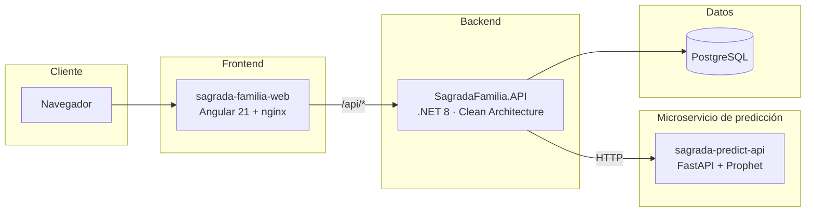
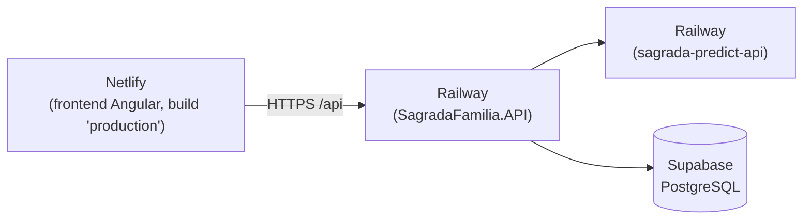

# La Sagrada Familia - Sistema de Monitoreo Pediátrico

Sistema web para la gestión clínica y el seguimiento del crecimiento infantil del **Consultorio Médico La Sagrada Familia** (Milagro, Ecuador). Permite administrar pacientes, agendar y atender citas, registrar consultas y prescripciones, dar seguimiento antropométrico (peso/talla/IMC contra referencias OMS) y predecir tendencias de crecimiento mediante series de tiempo.

Proyecto de tesis de grado - Ingeniería en Software.


---

## Índice

- [Descripción general](#descripción-general)
- [Características principales](#características-principales)
- [Arquitectura](#arquitectura)
- [Stack tecnológico](#stack-tecnológico)
- [Estructura del repositorio](#estructura-del-repositorio)
- [Requisitos previos](#requisitos-previos)
- [Puesta en marcha](#puesta-en-marcha)
  - [Opción A — Todo en Docker](#opción-a--todo-en-docker-recomendado-para-probar-el-sistema)
  - [Opción B — Desarrollo local](#opción-b--desarrollo-local-visual-studio--vs-code)
- [Variables de entorno](#variables-de-entorno)
- [Roles del sistema](#roles-del-sistema)
- [Módulos funcionales](#módulos-funcionales)
- [Despliegue en producción](#despliegue-en-producción)
- [Documentación adicional](#documentación-adicional)
- [Convenciones del proyecto](#convenciones-del-proyecto)
- [Licencia](#licencia)

---

## Descripción general

La Sagrada Familia digitaliza el flujo de atención pediátrica de un consultorio médico: desde el registro de padres y niños, pasando por el agendamiento y atención de citas, hasta el seguimiento longitudinal del crecimiento de cada paciente con gráficas clínicas y predicciones estadísticas. El sistema distingue tres roles (Administrador, Médico, Padre de familia), cada uno con una experiencia de interfaz adaptada a sus necesidades.

## Características principales

- **Gestión de citas** con validación de horario de atención configurable (horario de apertura/cierre y días hábiles), estados (Pendiente, En curso, Completada, Cancelada, No asistió, Reagendada) y notificaciones por correo.
- **Consultas clínicas**: diagnóstico, indicaciones y evolución registrados por el médico durante la cita.
- **Prescripciones médicas** con múltiples medicamentos y generación de PDF firmable (QuestPDF).
- **Seguimiento antropométrico**: registro de medidas (peso, talla) con gráficas comparadas contra las tablas de referencia de la OMS y cálculo de IMC.
- **Predicción de crecimiento** mediante un microservicio dedicado en Python (Prophet / series de tiempo).
- **Orientación alimentaria**: catálogo de alimentos recomendados por rango de edad.
- **Panel de administración**: usuarios, roles y permisos por módulo, parámetros del sistema, plantillas y eventos de correo, auditoría y bitácora de errores.
- **Autenticación JWT** con rotación de refresh token en cookies `httpOnly`, recuperación de contraseña y activación de cuenta por correo.
- **Auditoría y trazabilidad**: registro de acciones sensibles y logs de sistema, con soft delete en las entidades del dominio.
- **Modo oscuro** y sistema de diseño centralizado en el frontend.

## Arquitectura

El sistema se compone de cuatro servicios independientes:



**Backend** (`SagradaFamilia/`) sigue Clean Architecture en cuatro proyectos:

| Proyecto | Responsabilidad |
|---|---|
| `SagradaFamilia.Domain` | Entidades, enums, interfaces de repositorio, excepciones de dominio. Sin dependencias externas. |
| `SagradaFamilia.Application` | Casos de uso (Services), DTOs, validadores (FluentValidation), perfiles de mapeo (AutoMapper). |
| `SagradaFamilia.Infrastructure` | Persistencia (EF Core + Npgsql), repositorios, seeders, migraciones, integraciones (SMTP, PDF). |
| `SagradaFamilia.API` | Controllers REST, middlewares (manejo de excepciones, auditoría), configuración JWT/CORS, Swagger. |

**Frontend** (`sagrada-familia-web/`): Angular standalone components, señales (`signal`/`computed`) para estado local, estructura por *feature* (`pages/features/<módulo>`), servicios HTTP en `core/services`, interceptores para auth y hora de servidor, sistema de diseño centralizado en `styles.css`.

**Microservicio de predicción** (`sagrada-predict-api/`): FastAPI expone un endpoint que recibe el historial de medidas de un niño y devuelve una proyección de crecimiento generada con Prophet.

## Stack tecnológico

| Capa | Tecnología |
|---|---|
| Frontend | Angular 21 (standalone, signals), TailwindCSS 4, ApexCharts, ng-icons |
| Backend | .NET 8, ASP.NET Core Web API, Entity Framework Core (Npgsql) |
| Validación / mapeo | FluentValidation, AutoMapper |
| Autenticación | JWT (access + refresh token rotado en cookie `httpOnly`), BCrypt.Net |
| Documentos | QuestPDF (recetas en PDF), ClosedXML (exportes Excel) |
| Predicción | Python, FastAPI, Prophet, cmdstanpy, pandas |
| Base de datos | PostgreSQL 16 (local Docker) / Supabase (producción) |
| Infraestructura local | Docker Compose (db + api + predict + web vía nginx) |
| Despliegue | Railway (API + predict), Netlify (frontend), Supabase (BD) |
| CI | GitHub Actions — build y publicación de imágenes a Docker Hub al hacer merge a `main` |

## Estructura del repositorio

```
ProyectoSagradaFamilia/
├── SagradaFamilia/                  # Backend .NET 8 (Clean Architecture)
│   ├── SagradaFamilia.API/          # Controllers, middlewares, Program.cs
│   ├── SagradaFamilia.Application/  # Services, DTOs, validadores, mappings
│   ├── SagradaFamilia.Domain/       # Entidades, enums, interfaces
│   ├── SagradaFamilia.Infrastructure/ # EF Core, repositorios, seeders, migraciones
│   ├── Dockerfile
│   └── railway.toml
├── sagrada-familia-web/             # Frontend Angular 21
│   ├── src/app/pages/features/      # Módulos por funcionalidad (citas, pacientes, ...)
│   ├── src/app/core/                # Servicios HTTP, interceptores
│   ├── src/app/shared/              # Componentes, interfaces, utilidades compartidas
│   ├── src/environments/            # environment.ts / .development / .docker / .prod
│   ├── Dockerfile
│   └── nginx.conf
├── sagrada-predict-api/             # Microservicio Python de predicción (FastAPI + Prophet)
│   ├── app/
│   ├── main.py
│   └── railway.toml
├── docs/                            # Documentación de tesis, diagramas, manuales
├── diagramas/                       # Diagramas de arquitectura (.drawio)
├── docker-compose.yml               # Stack local completo (db + api + predict + web)
├── docker-compose.prod.yml          # Self-host con imágenes publicadas en Docker Hub
├── netlify.toml                     # Build config del frontend en Netlify
├── .env.example                     # Plantilla de variables de entorno
└── setup-railway.sh                 # Script de apoyo para configurar servicios en Railway
```

## Requisitos previos

- [Docker](https://www.docker.com/) y Docker Compose (para la Opción A, o para levantar solo PostgreSQL en la Opción B)
- [.NET SDK 8.0](https://dotnet.microsoft.com/download/dotnet/8.0) (Opción B)
- [Node.js 22+](https://nodejs.org/) y npm (Opción B)
- Visual Studio 2022 (recomendado para el backend) o cualquier IDE compatible con .NET
- Visual Studio Code (recomendado para el frontend)

## Puesta en marcha

### Opción A — Todo en Docker (recomendado para probar el sistema)

Levanta los cuatro servicios (PostgreSQL, API, microservicio de predicción y frontend con nginx) con un solo comando. Ideal para evaluar el sistema sin instalar SDKs.

```bash
cp .env.example .env
# completar POSTGRES_PASSWORD, JWT_SECRET_KEY y credenciales SMTP en .env

docker compose up --build -d
```

La aplicación queda disponible en **http://localhost**. Al iniciar, la API aplica migraciones y siembra datos base (roles, menús, usuario administrador, parámetros del sistema).

```bash
docker compose logs -f api   # seguir logs de un servicio
docker compose down          # detener el stack
docker compose down -v       # detener y borrar también los datos de la BD
```

> El build de `web` en este flujo usa la configuración de Angular `docker` (`environment.docker.ts`, `apiUrl: '/api'`), que nginx resuelve internamente contra el contenedor `api`. Es independiente de la configuración usada en desarrollo local y en Netlify.

### Opción B — Desarrollo local (Visual Studio + VS Code)

Flujo de trabajo día a día: solo PostgreSQL corre en Docker; backend y frontend se ejecutan de forma nativa para aprovechar debugging, hot reload, breakpoints, etc.

**1. Base de datos**

```bash
docker compose up -d db
```

**2. Backend** — abrir `SagradaFamilia/SagradaFamilia.slnx` en Visual Studio y ejecutar el perfil `http` (o `dotnet run --project SagradaFamilia.API`). Queda escuchando en `http://localhost:5151`, con Swagger en `http://localhost:5151/swagger`. Configurar la cadena de conexión hacia el Postgres de Docker (`Host=localhost;Port=5432;Database=SagradaFamiliaDb;...`) en `appsettings.Development.json` o variables de entorno de usuario.

**3. Frontend** — abrir `sagrada-familia-web/` en VS Code:

```bash
cd sagrada-familia-web
npm install
npm start          # ng serve, configuración 'development' → apiUrl: http://localhost:5151/api
```

La aplicación queda disponible en **http://localhost:4200**.

## Variables de entorno

Usadas por `docker-compose.yml` / `docker-compose.prod.yml`, definidas en `.env` (ver `.env.example`):

| Variable | Descripción |
|---|---|
| `POSTGRES_PASSWORD` | Contraseña del usuario `postgres` en el contenedor local de la base de datos. |
| `JWT_SECRET_KEY` | Clave HS256 para firmar los JWT (mínimo 32 caracteres). Generar con `openssl rand -base64 32`. |
| `DOCKERHUB_USER` | Usuario de Docker Hub — solo necesario para `docker-compose.prod.yml`. |
| `SMTP_FROM_EMAIL` / `SMTP_USERNAME` / `SMTP_PASSWORD` | Credenciales de un remitente Gmail (App Password) para el envío de correos transaccionales. |

Para despliegue en Railway existe además `.env.railway.example` con las variables equivalentes en ese entorno.

## Roles del sistema

| Rol | Vista principal | Capacidades |
|---|---|---|
| **Administrador** | Panel de gestión | Usuarios, roles y permisos por módulo, parámetros del sistema, plantillas/eventos de correo, auditoría, logs |
| **Médico** | Agenda clínica | Atención de citas, registro de consultas, emisión de prescripciones, medidas y predicciones de crecimiento de sus pacientes |
| **Padre de familia** | Vista simplificada | Historial de citas y crecimiento de sus hijos, sin gráficas técnicas ni acciones administrativas |

## Módulos funcionales

`Pacientes` · `Citas` (agenda, historial, reagendamiento) · `Consultas` · `Prescripciones` · `Medidas antropométricas` · `Predicciones de crecimiento` · `Alimentos` (orientación alimentaria) · `Padres de familia` · `Usuarios` · `Roles y permisos` · `Parámetros del sistema` · `Plantillas y eventos de correo` · `Auditoría` · `Logs del sistema`

## Despliegue en producción



- **Frontend**: Netlify construye con `netlify.toml` (`ng build --configuration production`), que usa `environment.prod.ts` apuntando al dominio de Railway.
- **Backend y microservicio de predicción**: Railway construye cada uno desde su propio `Dockerfile` (`railway.toml` por servicio).
- **Base de datos**: PostgreSQL administrado por Supabase.
- **CI**: al hacer merge de `dev` → `main`, `.github/workflows/docker-publish.yml` construye y publica en Docker Hub las tres imágenes (`api`, `predict`, `web`) para quien prefiera un despliegue self-hosted vía `docker-compose.prod.yml`.

## Documentación adicional

- `docs/` — documentación de tesis (capítulos, manual técnico, manual de usuario, requerimientos funcionales/no funcionales).
- `diagramas/` — diagramas de arquitectura (backend, frontend, predictor, despliegue local y cloud) en formato `.drawio`.
- `docs/diagramas/` — diagramas de secuencia por caso de uso y diagramas BPMN (AS-IS / TO-BE) del proceso de atención.

## Convenciones del proyecto

- **Commits**: [Conventional Commits](https://www.conventionalcommits.org/) en español con scope, p. ej. `fix(citas): ...`, `feat(padres): ...`, `build(docker): ...`.
- **Ramas**: `main` (producción, dispara publicación de imágenes) ← `dev` (integración).
- **Backend**: patrón repositorio + capa de servicios, soft delete y auditoría automática vía interceptor de `SaveChangesAsync` en `AppDbContext`.
- **Frontend**: componentes standalone, estado con signals, estilos reutilizables centralizados en `styles.css` (`.card`, `.form-input`, `.alert-*`, `.badge-*`).

## Licencia

Proyecto académico desarrollado como trabajo de titulación. Uso educativo - sin licencia de distribución comercial.
